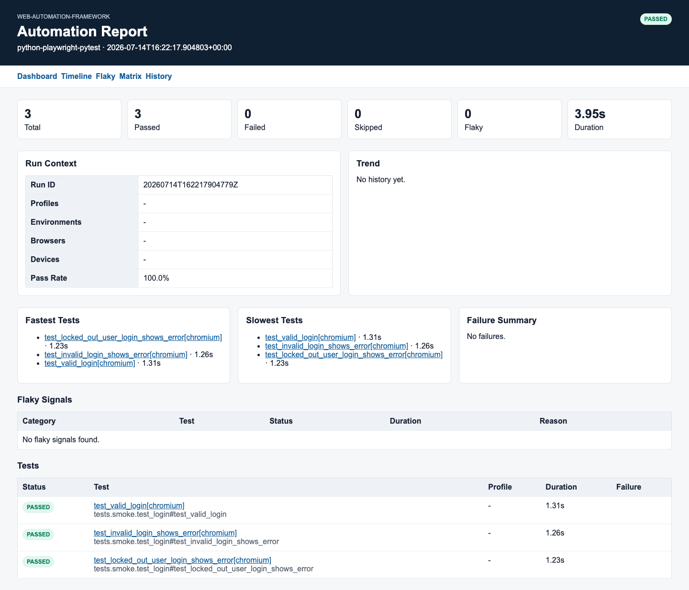
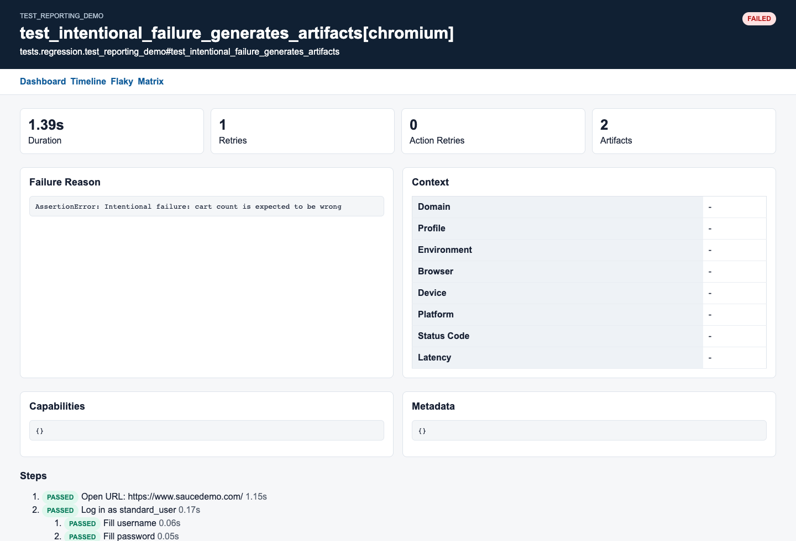
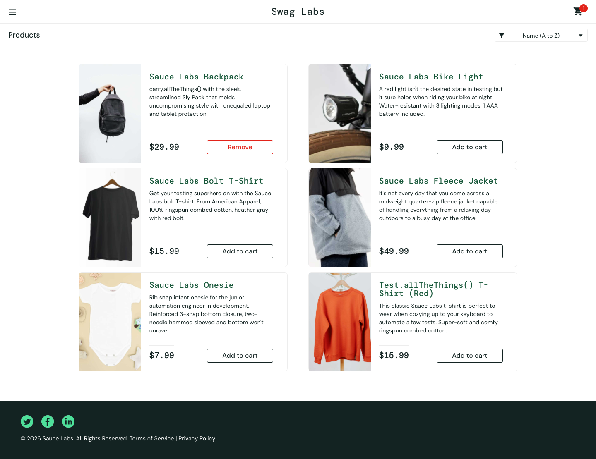
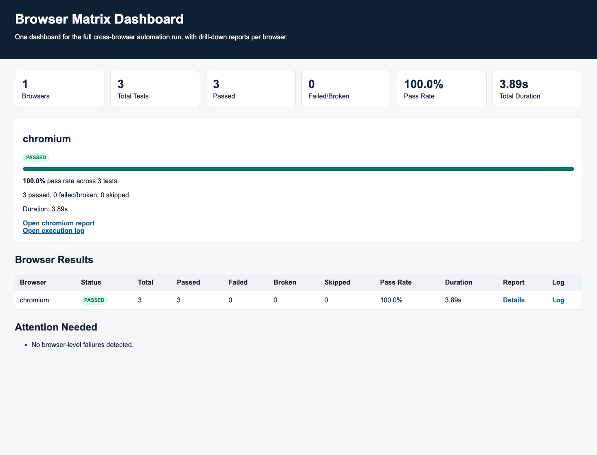

# Web Framework Walkthrough

This walkthrough shows a practical first run using the bundled SauceDemo sample, the starter project
layout, and the generated reports. The screenshots below were captured from a local Chromium run.

## 1. Set Up The Project

```bash
cd web-automation-framework
python -m venv .venv
source .venv/bin/activate
python -m pip install --upgrade pip
pip install -r requirements.txt
playwright install
python framework.py doctor
```

Optional integrations such as email OTP use environment variables. Start from the placeholder file
only when those helpers are needed:

```bash
cp .env.example .env
```

## 2. Run The Smoke Sample

Run the fast SauceDemo smoke tests in Chromium and generate the default core product report:

```bash
python framework.py run --smoke --browser chromium --report-kind core --no-open-report
```

Expected result:

```text
3 passed
reports/automation-report/index.html
```

The report dashboard summarizes the run, pass rate, slowest tests, failure summary, and drill-down
links.



## 3. Read Test Details And Artifacts

Each test links to a detail page with duration, retries, failure reason, steps, metadata, artifacts,
and timeline. The screenshot below comes from the intentionally failing reporting demo, which is
useful when validating screenshot, video, and trace capture.

```bash
python framework.py run --run-reporting-demo --markers reporting_demo --browser chromium --report-kind core --no-open-report
```

That command is expected to fail because the test is designed to prove artifact capture.



Failed browser tests also write files to:

```text
screenshots/
videos/
traces/
```

Example failure screenshot captured from the same run:



## 4. Run A Browser Matrix

Use the matrix runner when you want one isolated pytest session per browser and a top-level matrix
dashboard.

```bash
python scripts/run_browser_matrix.py --browsers chromium --env qa -m smoke --report-kind core --no-open-report
```

Expected outputs:

```text
reports/browser-matrix/index.html
reports/browser-matrix/reports/chromium/index.html
reports/browser-matrix/logs/chromium.log
```



## 5. Start A Product Suite From The Starter Template

This repository is a GitHub template repository. For a product-specific suite, start from the
template repository, then use `templates/starter_project/` as the product layer reference.

```bash
cp -R templates/starter_project/config ./config
cp -R templates/starter_project/pages ./pages
cp -R templates/starter_project/flows ./flows
cp -R templates/starter_project/tests ./tests
```

Then replace the sample URLs, page locators, flows, and test names with product-specific behavior.
Keep raw locators inside page objects, keep business journeys in flows, and keep tests focused on
readable scenarios.

## 6. Useful Commands

| Goal | Command |
| --- | --- |
| Run smoke tests | `python framework.py run --smoke --browser chromium` |
| Run headed for debugging | `python framework.py run --smoke --browser chromium --headed` |
| Run browser matrix | `python framework.py run --browsers chromium firefox webkit --smoke` |
| Generate core report | `python framework.py report generate --report-kind core --no-open` |
| Generate core plus official Allure | `python framework.py report generate --report-kind both --no-open` |
| Skip report opening | `--no-open-report` |
| Skip report generation | `--no-generate-report` |
